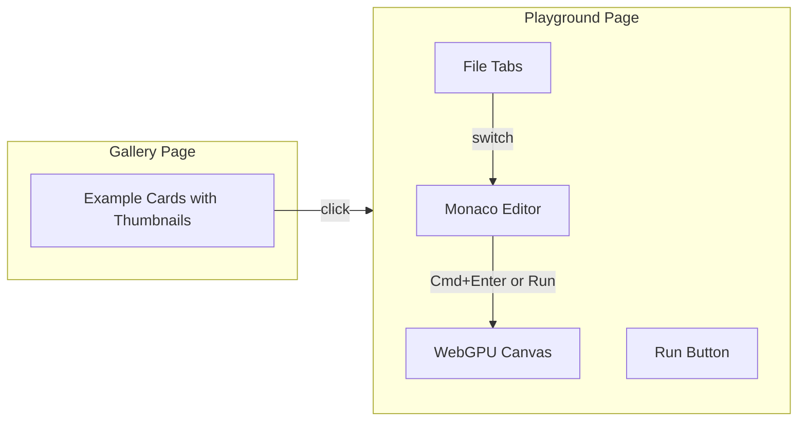

# Interactive Examples Gallery

## Design Decisions

| Question         | Decision                                                                 |
| ---------------- | ------------------------------------------------------------------------ |
| Code editor      | **Monaco Editor** - Full VS Code experience with TypeScript IntelliSense |
| Preview behavior | **Manual run** - User clicks "Run" button or presses Cmd/Ctrl+Enter      |

## Architecture Overview

## Completed Work

### 1. Monaco Editor Setup (Ralph 56)

- Installed @monaco-editor/react package
- Created MonacoEditor.tsx wrapper with Cmd+Enter support

### 2. Examples Registry (Ralph 57)

- Created lib/examples.ts with ExampleMeta interface
- Extracted shader code from all 18 examples
- Helper functions: getExampleBySlug, getExamplesByCategory, getAllCategories

### 3. Gallery Page (Ralph 58)

- Redesigned with dark theme and category sections
- ExampleCard component with hover effects
- Links to /playground/[slug]

### 4. Playground Page (Ralph 59)

- Split layout: Monaco editor (left) + WebGPU preview (right)
- Preview component that compiles WGSL shaders
- Run button and error display
- Dark theme styling

### 5. Thumbnail Script (Manual)

- Created scripts/generate-thumbnails.ts
- Uses Playwright to capture screenshots
- Added generate:thumbnails npm script

## Remaining Work

### File Tabs (Pending)

The original request wanted multiple files (HTML and index.ts). Current implementation only edits shader code. This is a lower priority enhancement.

## Files Modified/Created

- apps/examples/components/MonacoEditor.tsx
- apps/examples/components/Preview.tsx
- apps/examples/components/ExampleCard.tsx
- apps/examples/lib/examples.ts
- apps/examples/app/page.tsx (gallery)
- apps/examples/app/playground/[slug]/page.tsx
- apps/examples/app/test-monaco/page.tsx
- apps/examples/scripts/generate-thumbnails.ts
- apps/examples/public/thumbnails/ (directory)
